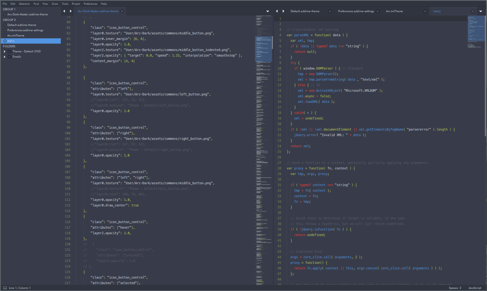

# Sublime Text 3 Arc-Dark theme



## Instalation

Clone this repository into Package folder:

```bash
$ cd ~/.config/sublime-text-3/Packages/User/
$ git clone https://github.com/madeindjs/Sublime-Text-3-Arc-Dark-theme
```

And add thoses lines to your settings *Preferences > Settings* 

```json
"color_scheme": "Packages/User/Sublime-Text-3-Arc-Dark-theme/schemes/Arc.tmTheme",
"theme": "Arc-Dark.sublime-theme",
```

Permission granted for use of assets by Horst3180.